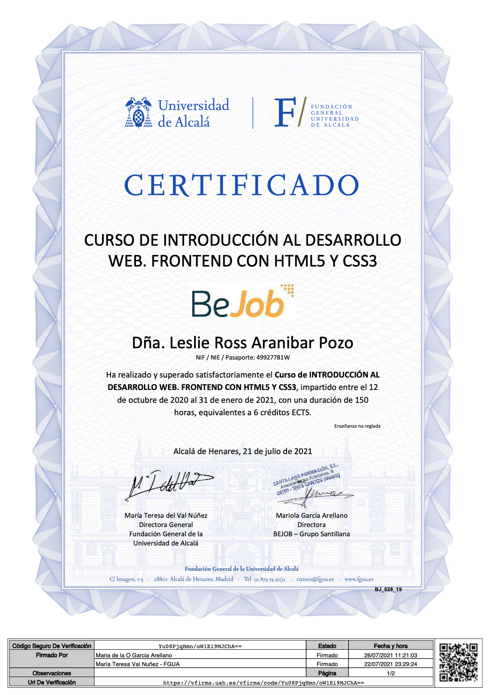

<h1 align=center>Hello World! I'm Leslie Ross
 
  </h1>
 

 

 

* 📚 Currently studying *CFGS DAW Dual* in [Francesc de Borja Moll](https://www.cifpfbmoll.eu)

* 🧠 Learning various programming lenguages such as **Java**, **Python** or **JavaScript**.
* 🎨 Also have knowledge of SEO and branding
* 📬 Email me at **laranibarpozo@cifpfbmoll.eu** or **aleslieross@gmail.com**

### Languages and Tools I'm Familiar With:

	
	
	<a href="https://www.python.org" targer="blank">
		
	
	<a href="https://www.w3.org/Style/CSS/" targer="blank">
		
	<a href="https://www.javascript.com" targer="blank">
		
		
	
	
	
    
    

### Connect with Me:

---
### Coures:

<h3>University of Alcalá de Henares </h3>
<h4 align="center">Introduction to Web Development. Front-End with HTML5 and CSS3</h4>

  
 

---
### GitHub info:

 

